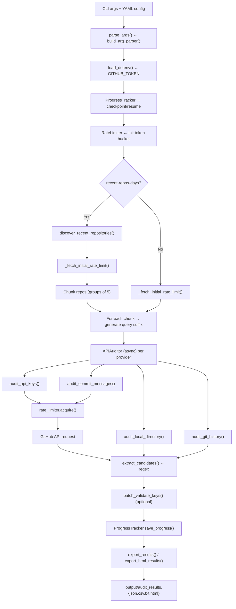

# 🔍 CredsClaw

> **Async Python CLI** that scans GitHub repositories, local directories, and git history for leaked API keys and secrets across **13 providers**. Features intelligent confidence scoring, deduplication, checkpoint/resume, and rich HTML reports.

[](# )
[](# )
[](# )

---

## Table of Contents

- [Features](#features)
- [Quick Start](#quick-start)
- [GitHub Token Setup](#github-token-setup)
- [Installation](#installation)
- [Usage](#usage)
- [Scan Modes](#scan-modes)
- [Supported Providers](#supported-providers)
- [Confidence Scoring](#confidence-scoring)
- [Configuration](#configuration)
- [Output Formats](#output-formats)
- [Docker](#docker)
- [Pre-commit Hook](#pre-commit-hook)
- [Architecture](#architecture)
- [Development](#development)
- [FAQ](#faq)

---

## Features

| Feature | Description |
|---|---|
| **4 scan modes** | GitHub code search, commit messages, local directory, git history |
| **Recent-repo discovery** | Auto-discover repos pushed to in last N days and scan them |
| **13 provider patterns** | OpenAI, Anthropic, Google, AWS, Stripe, GitHub, Slack, Twilio, SendGrid, HuggingFace, Cloudflare, Supabase, Azure |
| **Confidence scoring** | Multi-factor analysis: Shannon entropy, context keywords, length, character diversity, noise penalties |
| **Severity tiers** | CRITICAL (80+), HIGH (60-79), MEDIUM (40-59), LOW (<40) |
| **Live validation** | Ping provider APIs to confirm whether discovered keys are still active |
| **Deduplication** | SHA-256 fingerprinting prevents the same key from being reported twice |
| **Checkpoint / Resume** | Save progress mid-scan and resume later without re-scanning |
| **HTML reports** | Interactive, sortable, filterable HTML reports with severity bars |
| **Encrypted output** | Fernet-symmetric encryption for sensitive results |
| **Pre-commit integration** | Built in `.pre-commit-config.yaml` generation |
| **YAML config** | Persistent configuration with CLI override precedence |
| **Dry-run mode** | Estimate scope without fetching file contents |
| **Allow / deny patterns** | Regex-based filtering to include or exclude matches |

---

## Quick Start

```bash
# 1. Install
git clone <repo-url> && cd credsclaw
pip install -e .

# 2. Set your GitHub token (see "GitHub Token Setup" below)
echo "GITHUB_TOKEN=ghp_..." > .env

# 3. Run a scan
python -m auditor --repo owner/repo --providers openai,github,aws

# 4. Try local directory scan
python -m auditor --mode local --dir . --providers all
```

---

## GitHub Token Setup

CredsClaw needs a GitHub personal access token to search code and commits. Here's how to create one:

1. **Go to** [GitHub Settings → Developer settings → Personal access tokens → Tokens (classic)](https://github.com/settings/tokens)
2. **Click** *Generate new token* → *Generate new token (classic)*
3. **Give it a name** (e.g., `credsclaw`)
4. **Set expiration** — choose 30/60/90 days or *No expiration*
5. **Select scopes** — check **`repo`** (for private repos) or just **`public_repo`** (for public repos only) + **`read:org`** (optional, for org-wide search)
6. **Click** *Generate token* and **copy the token** (starts with `ghp_` or `github_pat_`)
7. **Save it** in a `.env` file in the project root:

   ```bash
   echo "GITHUB_TOKEN=your_token_here" > .env
   ```

> **Note:** The token is only used to authenticate with GitHub's API. It's never stored in results or sent anywhere else.

---

## Installation

### Standard

```bash
pip install -r requirements.txt
pip install -e .
```

### Dependencies

- `aiohttp` — async HTTP for GitHub API and live key validation
- `tqdm` — progress bars during scanning
- `python-dotenv` — `.env` file loading
- `pyyaml` — YAML config parsing
- `cryptography` — required for encrypted output

---

## Usage

```bash
python -m auditor [options]
```

### Basic Examples

```bash
# Scan a specific GitHub repository for OpenAI and AWS keys
python -m auditor --repo owner/repo --providers openai,aws

# Scan the current directory for all 13 provider patterns
python -m auditor --mode local --dir . --providers openai,anthropic,google,aws,stripe,github,slack,twilio,sendgrid,huggingface,cloudflare,supabase,azure

# Check your own git history for accidentally committed secrets
python -m auditor --mode git-history --dir . --providers github --confidence-threshold 60

# Generate an interactive HTML report
python -m auditor --mode local --dir ./project --providers all --output-format html

# Scan everything and validate live keys against provider APIs
python -m auditor --repo owner/repo --providers all --validate
```

### Common Options

| Flag | Default | Description |
|---|---|---|
| `--mode` | `code` | Scan mode: `code`, `commits`, `local`, `git-history` |
| `--providers` | `openai,anthropic` | Comma-separated provider list (or `all` for every provider) |
| `--repo` | (empty) | Specific repository: `owner/repo` |
| `--dir` | (empty) | Directory for local/git-history mode |
| `--output-format` | `json` | Output format: `json`, `csv`, `txt`, `html` |
| `--output-file` | `output/audit_results.{ext}` | Custom output path |
| `--confidence-threshold` | `50.0` | Minimum score (0-100) to report a finding |
| `--validate` | off | Ping provider APIs to confirm keys are live |
| `--dry-run` | off | Count matches without fetching contents |
| `--max-concurrency` | `10` | Parallel file processors |
| `--store-raw-keys` | off | Store raw keys in output (unsafe, use encryption) |
| `--encrypt-output` | off | Encrypt results with Fernet |
| `--encryption-key` | `""` | ⚠️ Deprecated — use `OUTPUT_ENCRYPTION_KEY` env var instead |
| `--no-ssl-verify` | off | Disable SSL certificate verification (for corporate proxies) |
| `--config` | `auditor.yaml` | YAML configuration file path |
| `--recent-repos-days` | (empty) | Discover repos pushed to in last N days (mode: `code`/`commits` only, not compatible with `--repo`/`--dir`) |
| `--resume` | off | Continue from previous checkpoint |
| `--checkpoint-file` | `output/progress.json` | Path to checkpoint file |
| `--since-checkpoint` | off | Only process items newer than checkpoint timestamp |
| `--checkpoint-interval` | `25` | Save checkpoint every N processed items |
| `--timeout` | `10` | Validation request timeout in seconds |
| `--allow-patterns` | (empty) | Comma-separated regex allow patterns |
| `--deny-patterns` | (empty) | Comma-separated regex deny patterns |
| `--generate-pre-commit-hook` | off | Write `.pre-commit-config.yaml` and exit |
| `--help` | | Show full argument reference |

### GitHub Filters

| Flag | Description |
|---|---|
| `--recent-repos-days` | Discover repos pushed to in last N days (disables `--repo`/`--dir`) |
| `--max-pages` | Maximum GitHub API pages |
| `--min-stars` | Minimum repository stars |
| `--language` | Programming language filter |
| `--updated-after` | Only repos updated after date (YYYY-MM-DD) |
| `--extensions` | File extension filter (e.g., `py,js,env`) |
| `--sort` | Sort mode for GitHub search (default: `indexed`) |

---

## Scan Modes

### `code` (default) — GitHub Code Search

Searches GitHub's code index for exposed keys. Requires a `GITHUB_TOKEN` (set in `.env` or pass on prompt).

```bash
python -m auditor --repo django/django --providers openai,stripe
```

Use `--recent-repos-days` to auto-discover and scan public repos pushed to recently:

```bash
python -m auditor --recent-repos-days 7 --providers all --mode code
```

### `commits` — GitHub Commit Message Search

Scans commit messages for keys accidentally described or included in commit text.

```bash
python -m auditor --mode commits --providers github
```

### `local` — Local Directory Scan

Recursively scans all files in a local directory. Automatically skips binary files, hidden directories (`.git`, `.venv`), and respects `--extensions` filters. **Does not require a GitHub token.**

```bash
python -m auditor --mode local --dir . --providers aws,github --output-format html
```

### `git-history` — Local Git History Scan

Runs `git log --all` and inspects every commit's diff content for exposed keys. Useful for finding keys that were committed and later removed.

```bash
python -m auditor --mode git-history --dir ./my-repo --providers slack,twilio
```

---

## Supported Providers

| Provider | Pattern Prefix | Live Validation |
|---|---|---|
| **OpenAI** | `sk-` | ✓ |
| **Anthropic** | `sk-ant-` | ✓ |
| **Google AI** | `AIza`, `AQ.` | — |
| **AWS** | `AKIA`, `ASIA`, `ABIA`, `ACCA` | — |
| **Stripe** | `sk_`, `pk_`, `rk_`, `whsec_` | ✓ |
| **GitHub** | `ghp_`, `gho_`, `ghs_`, `ghr_`, `ghu_`, `github_pat_` | ✓ |
| **Slack** | `xoxb-`, `xapp-`, `xwfp-`, `hooks.slack.com` | ✓ |
| **Twilio** | `SK`, `AC` | — |
| **SendGrid** | `SG.` | ✓ |
| **HuggingFace** | `hf_` | ✓ |
| **Cloudflare** | `cfk_`, `cfut_`, `cfat_` | ✓ |
| **Supabase** | `sbp_`, `sb_publishable_`, `sb_secret_` | ✓ |
| **Azure** | `Endpoint=sb://` | — |

Live validatable providers ping their respective APIs to confirm whether the discovered key is still active.

---

## Confidence Scoring

Each potential secret is scored from **0–100** using a multi-factor model. The score determines both whether the result is reported (based on `--confidence-threshold`) and its severity label.

### Scoring Factors

| Factor | Max Points | Description |
|---|---|---|
| **Shannon Entropy** | 30 | Higher randomness = more likely a real key |
| **Context Keywords** | 25 | Surrounding text contains `api_key`, `secret`, `token`, etc. |
| **Noise Penalty** | 20 | Full score if no noise words (`example`, `dummy`, `changeme`…); 0 if detected |
| **Key Length** | 15 | Longer keys are more likely real: 32+ chars = 15pt |
| **Character Diversity** | 10 | Unique character ratio to total length |

### Severity Tiers

| Score | Label |
|---|---|
| 80–100 | 🔴 **CRITICAL** |
| 60–79 | 🟠 **HIGH** |
| 40–59 | 🟡 **MEDIUM** |
| 0–39 | 🟢 **LOW** |

---

## Configuration

### YAML Config File

Create `auditor.yaml` in the project root:

```yaml
providers: openai,github,aws
mode: local
dir: ./project
output_format: html
output_file: output/report.html
confidence_threshold: 60.0
max_concurrency: 5
validate: false
encrypt_output: false
```

CLI flags always take precedence over config file values.

### Environment Variables

| Variable | Required | Description |
|---|---|---|
| `GITHUB_TOKEN` | For GitHub modes | Personal access token with `repo` or `public_repo` scope ([how to create](#github-token-setup)) |
| `OUTPUT_ENCRYPTION_KEY` | For encrypted output | Fernet key (32 base64-encoded bytes) |

Both can be loaded from a `.env` file in the project root.

---

## Output Formats

### JSON (`output/audit_results.json`)

Full structured data including masked keys, hashes, timestamps, and validation status.

### CSV (`output/audit_results.csv`)

Flat table suitable for spreadsheet analysis.

### TXT (`output/audit_results.txt`)

Human-readable text summary of each finding.

### HTML (`output/audit_results.html`)

Interactive report with:

- **Severity bar charts** — visual breakdown by severity
- **Sortable table** — click any column header to sort
- **Live filter** — type to filter by provider, severity, repo, or path
- **Expandable rows** — click to reveal commit hash, URL, timestamps, and raw key
- **Dark theme** — GitHub-dark inspired color scheme

### Encryption

All formats support `--encrypt-output` using Fernet symmetric encryption:

```bash
python -m auditor --mode local --dir . --store-raw-keys --encrypt-output
```

---

## Docker

### Build

```bash
docker build -t credsclaw .
```

### Run

```bash
# Local directory scan (mount target directory)
docker run --rm -v "$(pwd):/work" credsclaw --mode local --dir /work --providers all

# GitHub scan (pass token via env)
docker run --rm -e GITHUB_TOKEN=ghp_... credsclaw --repo owner/repo --providers openai

# With HTML output
docker run --rm -v "$(pwd):/work" credsclaw --mode local --dir /work --providers all --output-format html --output-file /work/output/report.html
```

### Docker Compose

```bash
docker-compose up
```

Output is written to `./docker-output/` by default.

---

## Pre-commit Hook

Generate a `.pre-commit-config.yaml` in one command:

```bash
python -m auditor --generate-pre-commit-hook
```

This creates a local pre-commit hook that runs a dry-run scan on all staged text files:

```yaml
repos:
  - repo: local
    hooks:
      - id: credsclaw
        name: CredsClaw
        description: Scans staged files for exposed API keys and secrets
        entry: python -m auditor --mode local --dir . --confidence-threshold 60.0 --dry-run
        language: system
        types: [text]
        pass_filenames: false
```

---

## Architecture

```
auditor/                        # Installable Python package
├── __init__.py                 # Package init, logging setup, re-exports
├── __main__.py                 # Entry point: argparse → dispatch → export
├── patterns.py                 # 13 regex patterns, noise list, provider registry
├── scoring.py                  # Shannon entropy, confidence scoring, severity, masking
├── scanner.py                  # APIAuditor class — all 4 scan modes
├── validator.py                # Live API validation for 9 providers
├── exporter.py                 # JSON/CSV/TXT/HTML export + summary printer
├── tracker.py                  # Checkpoint/resume state management
├── cli.py                      # Argparse builder, config merge, pre-commit hook
├── config.py                   # YAML config file loader
├── rate_limiter.py             # Token-bucket rate limiter (+ exponential backoff) to prevent concurrent-task quota exhaustion
└── utils.py                    # ISO-8601 parsing, UTC timestamp helper

tests/                          # Module-scoped test files
├── test_patterns.py            # Pattern matching tests
├── test_scoring.py             # Scoring, masking, fingerprinting tests
├── test_config.py              # Config loading and merging tests
├── test_cli.py                 # CLI parsing and pre-commit hook tests
├── test_exporter.py            # HTML export and format tests
└── test_scanner.py             # Noise/allow/deny filtering, git history tests
```

### Data Flow



---

## Development

### Setup

```bash
git clone <repo-url>
cd credsclaw
pip install -e .
pip install pytest
```

### Running Tests

```bash
python -m pytest tests/ -v        # 50 tests
python -m pytest tests/ -q        # compact output
```

### Codebase Stats

| Language | Files | Code | Comment |
|---|---|---|---|
| Python | 19 | ~2,600 | ~200 |
| TOML | 1 | 21 | 0 |
| Markdown | 1 | 0 | 194 |
| **Total** | **25** | **~2,621** | **~394** |

### Project Layout Principles

- **Single Responsibility** — each module has one concern (scoring, validation, export…)
- **No Circular Imports** — dependency graph flows: `utils → patterns → scoring → scanner → exporter`
- **Async First** — `asyncio.gather` + `Semaphore` for parallel provider scans
- **Test Coverage** — all public methods tested, git history tests use real `git` commands

---

## FAQ

**Q: Why didn't the scan find the key in my `.env` file?**

Make sure you're using local mode (`--mode local --dir .`). Code search mode only looks at GitHub. If it still doesn't find it, check that the `.env` file isn't excluded by the hidden-directory filter — hidden files (like `.env`) are included, only hidden directories are skipped.

**Q: Does the tool upload my keys anywhere?**

**No.** All scanning is local. In GitHub code-search mode, the tool fetches file contents from GitHub's API, processes them locally, and never sends discovered keys anywhere. Live validation sends the key directly to the provider's API (e.g., `api.openai.com`) for a single validation request.

**Q: How do I avoid false positives from test keys?**

Increase `--confidence-threshold` (e.g., `--confidence-threshold 70`) or add deny patterns: `--deny-patterns test,mock,dummy`. Test keys with high entropy may still trigger — consider using placeholder values like `sk-test-...` which match the noise filter.

**Q: Can I scan a private repository?**

Yes. Your `GITHUB_TOKEN` needs `repo` scope for private repos. Ensure it has the appropriate permissions in GitHub Settings → Developer Settings → Personal Access Tokens.

**Q: What is the rate limit for GitHub API?**

GitHub allows 10–30 requests per minute for search, depending on your token's level. The tool handles rate limiting with exponential backoff (up to 5 retries, max 300s wait). For large scans, use `--max-pages` to limit scope.

---

## License

MIT
